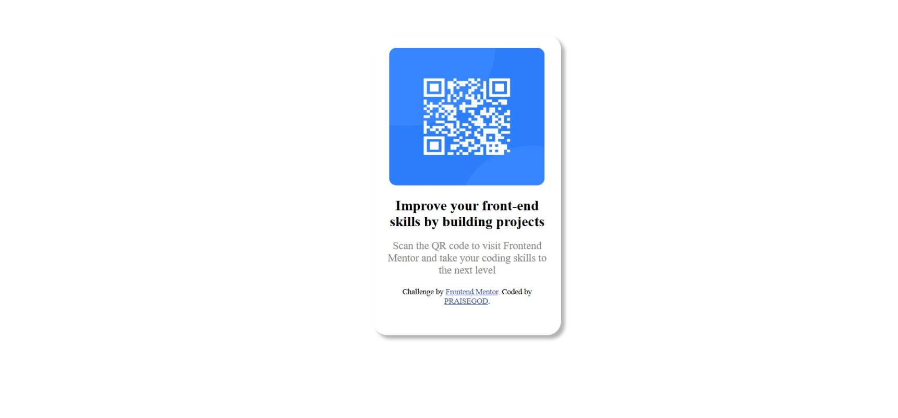

# Frontend Mentor - QR code component solution

This is a solution to the [QR code component challenge on Frontend Mentor](https://www.frontendmentor.io/challenges/qr-code-component-iux_sIO_H). Frontend Mentor challenges help you improve your coding skills by building realistic projects. 

## Table of contents

- [Overview](#overview)
  - [Screenshot](#screenshot)
  - [Links](#links)
- [My process](#my-process)
  - [Built with](#built-with)
  - [What I learned](#what-i-learned)
  - [Continued development](#continued-development)
  - [Useful resources](#useful-resources)
- [Author](#author)


## Overview

### Screenshot

]("c:\Users\HP\Documents\frontend  mento projects\images\Screenshort.jpeg") 

### Links

- Solution URL: [Add solution URL here](https://your-solution-url.com)
- Live Site URL: [Add live site URL here](https://your-live-site-url.com)

## My process

### Built with

- Semantic HTML5 markup
- CSS custom properties

### What I learned
        Well, I learnth alot from working on this project even though I have been having a little problem on styling the backgroung colour of my Qr Code.
        I length how to use the margin-left, right and top to move my Qr code to the center of my webpage. learnt how to change the front-size, color of my texts and finially learnt how to add a shadow behind my Qr code which till now gives me the chills....🥶


```css
body {
   border-radius: 20px;
    margin-left: 500px;
    margin-top: 50px;
     box-shadow: 5px 5px 5px rgba(0, 0, 0, 0.3);
}

h1{
     font-size: 20px;
}
```

### Continued development
I focuse more on my webdevelopmet, even though its been long since i visited it, but with this projects i might just be able to get back on track.

### Useful resources

- [Example resource 1](https://www.coursera.org/) - This helped me for my foundations in how to use html and css effectively. I really liked their pattern of teaching and will use it going forward.

## Author

- Website - [Okorie PraiseGod . E.](https://www.your-site.com)
- Frontend Mentor - [@Peolite1](https://www.frontendmentor.io/profile/Peolite1)
- Twitter - [@prai79461](https://x.com/prai79461)

